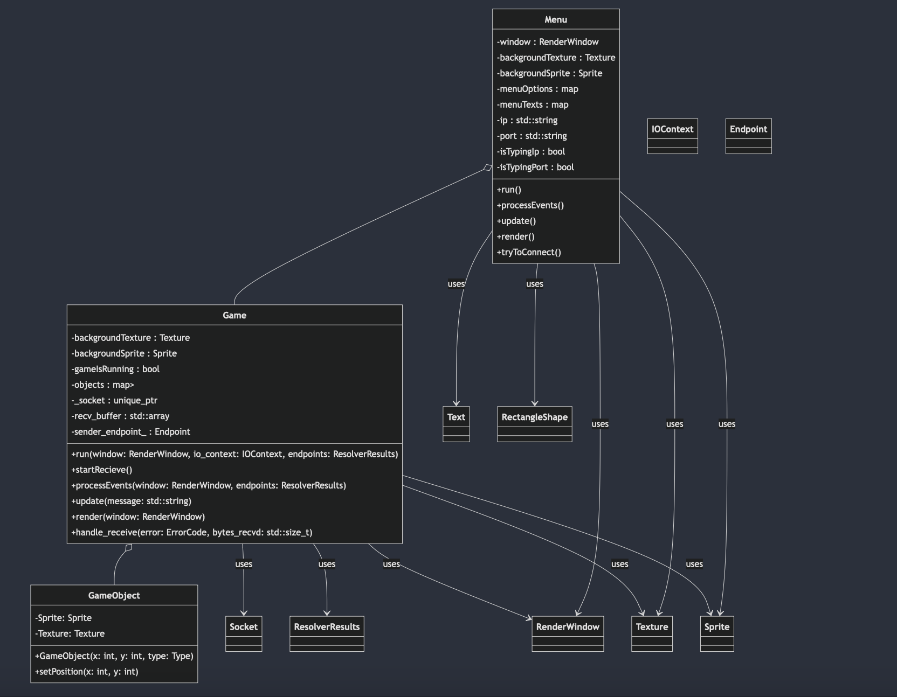

# R-Type Client Documentation

## Overview

This project is an implementation of a game called R-Type, which includes network communication using Boost.Asio (UDP), graphical rendering using SFML, and a menu interface to handle user input and game control.

The project consists of three main components:
- **Game**: Manages the game loop, event processing, rendering, and network communication with the server.
- **GameObject**: Represents various objects in the game, such as players, enemies, and bullets.
- **Menu**: Displays the main menu, processes user inputs, and initializes the game.

The communication between the client and server is done using UDP sockets, where the client sends control messages, and the server responds with updates that are processed by the game.

## Dependencies

- **SFML** (Simple and Fast Multimedia Library) for graphics and window management.
- **Boost.Asio** for network communication (UDP).
- **C++ Standard Library** for core functionality.

## Class Descriptions:

### `Game`

The `Game` class manages the main game loop, processes events, and communicates with the server over UDP.

- **Attributes**:
  - `_socket`: A unique pointer to a UDP socket.
  - `gameIsRunning`: A boolean flag to indicate if the game is currently running.
  - `backgroundTexture` and `backgroundSprite`: SFML components to render the game background.
  - `objects`: A map storing all game objects (players, enemies, bullets).
  - `recv_buffer`: A buffer to store incoming messages from the server.
  - `sender_endpoint_`: The sender's endpoint for receiving messages.

- **Methods**:
  - `run()`: Starts the game, sends an initial message to the server, and handles the game loop.
  - `startRecieve()`: Starts receiving data asynchronously from the server.
  - `processEvents()`: Processes input events like keyboard and mouse presses.
  - `update()`: Updates the game state based on the server's messages.
  - `handle_receive()`: Processes received messages and restarts the receive operation.
  - `render()`: Draws the game objects on the window.

### `GameObject`

The `GameObject` class represents an object in the game such as a player, enemy, or bullet.

- **Attributes**:
  - `Sprite`: An SFML sprite used to display the game object.
  - `Texture`: An SFML texture that holds the image of the game object.

- **Methods**:
  - `GameObject()`: Initializes the game object with a position and type (player, enemy, or bullet).
  - `setPosition()`: Updates the position of the game object.

### `Menu`

The `Menu` class manages the main menu and handles user input to either start the game or exit.

- **Attributes**:
  - `window`: An SFML window object to render the menu.
  - `backgroundTexture` and `backgroundSprite`: SFML components to display the menu background.
  - `menuOptions` and `menuTexts`: Maps of menu options and corresponding text.
  - `ip` and `port`: Strings for IP address and port input by the user.
  - `isTypingIp` and `isTypingPort`: Booleans to track if the user is typing in the IP or port fields.

- **Methods**:
  - `run()`: The main menu loop that processes events and renders the menu.
  - `processEvents()`: Handles mouse clicks and keyboard inputs to navigate the menu and start the game.
  - `update()`: Updates the menu display.
  - `render()`: Draws the menu options and updates the screen.
  - `tryToConnect()`: Attempts to connect to the server and start the game using the provided IP and port.

## Diagram

## Game Flow

- Menu: The user interacts with the main menu to either start the game or exit.
- Connection: The user inputs the server's IP address and port, and attempts to connect to the server.
- Game Initialization: Upon a successful connection, the game initializes and starts the main loop.
- Game Loop:
    The game receives updates from the server.
    The game processes player inputs (e.g., movement, actions).
    The game renders objects (players, enemies, bullets) based on the received data.
- Exit: The user can exit the game by pressing a key or closing the window.

## Error Handling

- If there is an error in receiving data from the server, an error message is displayed.
- If the server sends invalid data, the game handles it gracefully and continues to function.
- The game also ensures that textures are loaded correctly, otherwise, exceptions are thrown.

## Conclusion

This project demonstrates networked game development using C++ with SFML for graphics and Boost.Asio for networking. The game structure allows for continuous communication with a server, where the server controls the game state, and the client processes input and renders the updated game objects.
