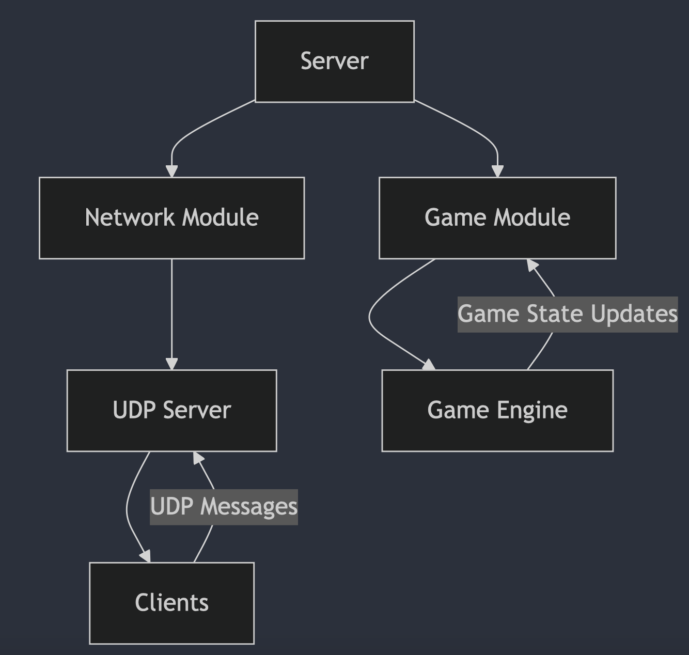
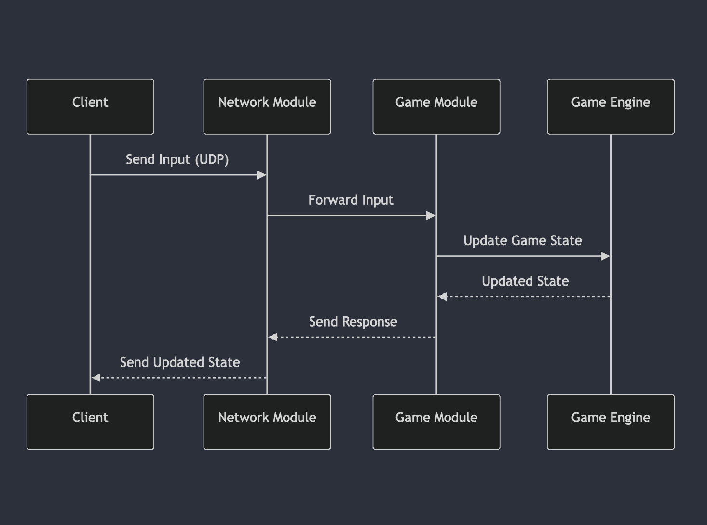

# R-Type UDP Server Documentation

This document provides a comprehensive overview of the R-Type UDP Server project, including the architecture, main components, and interactions between the server, game module, and network module.

## Table of Contents

1. [Introduction](#introduction)
2. [Architecture](#architecture)
3. [Main Components](#main-components)
    - [Server](#server)
    - [Game Module](#game-module)
    - [Network Module](#network-module)
    - [UDP Server](#udp-server)
4. [Communication Flow](#communication-flow)
5. [Code Examples](#code-examples)
6. [Conclusion](#conclusion)

## Introduction

The **R-Type UDP Server** is a component of the R-Type project that handles network communication using UDP protocol to facilitate real-time multiplayer functionality. The server handles player connections, game state management, and communication between different modules.

## Architecture

The server architecture is built on top of modules, each with specific responsibilities, connected through sockets. The server interacts with:
- **Game Module**: Manages the game state and handles incoming commands from clients.
- **Network Module**: Handles the low-level network communication, specifically with UDP.
- **Clients**: Connected via sockets and represented within the server.

Below is a high-level diagram showing the structure:



## Main Components

### Server
The Server class coordinates the creation and communication of different modules, handles incoming connections from clients, and routes messages between the game and network modules.

Key methods:

`start()`: Initializes and starts the server and its modules.
`run()`: The main loop that handles the message routing.
`stop()`: Gracefully stops the server and its modules.

Example:

```
void Server::start() {
    // Initialize network and game modules
    NetworkModule* networkModule = new NetworkModule("NetworkModule");
    GameModule* gameModule = new GameModule("GameModule");

    createModule(networkModule);
    createModule(gameModule);
}
```

## Game Module
The Game Module manages the game logic, such as player movements, enemy AI, and score calculations. It receives inputs from the clients through the server and updates the game state accordingly.

Key methods:

`run()`: Main loop for handling the game logic and player inputs.
`stop()`: Stops the game module and any associated threads.
`encodeInterCommunication()`: Encodes messages for communication with other modules.

Example

```cpp
void GameModule::run() {
    _game.start();
    while (_Running) {
        // Handle game logic and inputs from players
    }
}
```

## Network Module
The Network Module handles communication over UDP. It sends and receives messages from clients and communicates with the game module to relay game state and inputs.

Key methods:

`start()`: Starts the network module and begins listening for UDP messages.
`run()`: Main loop to handle network messages.
`stop()`: Stops the network communication.

Example

```cpp
void NetworkModule::run() {
    fd_set readfds;
    while (_Running) {
        FD_ZERO(&readfds);
        FD_SET(_socket, &readfds);
        // Handle network messages
    }
}
```

## UDP Server
The UDP Server is responsible for the actual sending and receiving of UDP packets. It handles incoming messages from clients, decodes them, and forwards them to the network module.

Key methods:
`start_receive()`: Begins listening for incoming UDP packets.
`handle_receive()`: Processes incoming messages and forwards them to the appropriate module.

Example

```cpp
void UDPServer::start_receive() {
    _socket.async_receive_from(
        boost::asio::buffer(_recv_buffer), _remote_endpoint,
        [this](std::error_code ec, std::size_t bytes_recvd) {
            handle_receive(bytes_recvd);
        });
}
```

## Communication Flow
- Client sends input: A client sends input to the server via UDP.
- Network Module processes input: The network module receives the input and forwards it to the game module.
- Game Module updates game state: The game module processes the input, updates the game state, and prepares a response.
- Response sent back: The game module sends the updated state back to the network module, which sends it to the client.

The communication between clients, server, and modules is shown in the following flowchart:



## Code Examples
Here are a few snippets from the server showing critical parts of the implementation:

Server Start

`server.start();`

- Game Module Processing

```cpp
void GameModule::run() {
    _game.start();
    while (_Running) {
        // Game loop
    }
}
```

- Network Communication

```cpp
void NetworkModule::run() {
    fd_set readfds;
    while (_Running) {
        FD_ZERO(&readfds);
        FD_SET(_socket, &readfds);
        // Handle network messages
    }
}
```

## Conclusion

The R-Type UDP Server is a robust and modular system for handling multiplayer interactions using UDP. By separating responsibilities into distinct modules, the server ensures scalability and maintainability. Future improvements could include better error handling, optimization of the message-passing mechanism, and more detailed game state tracking.
